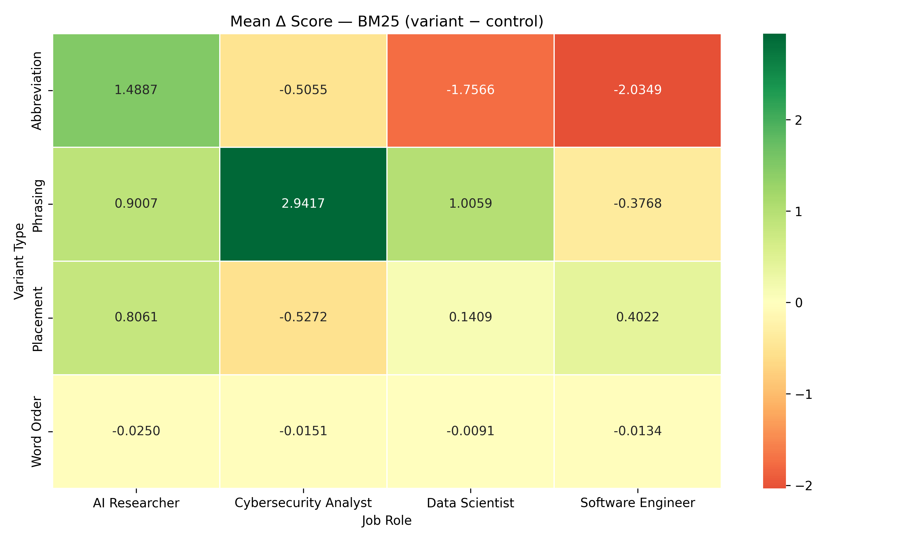
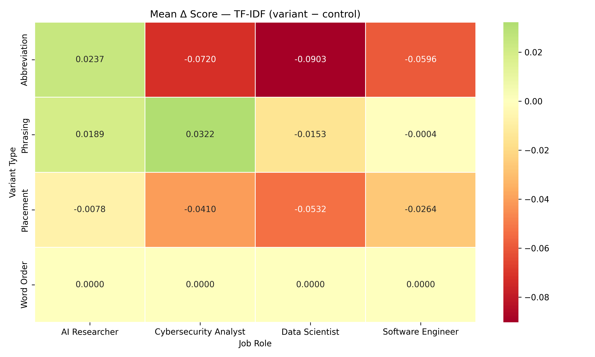
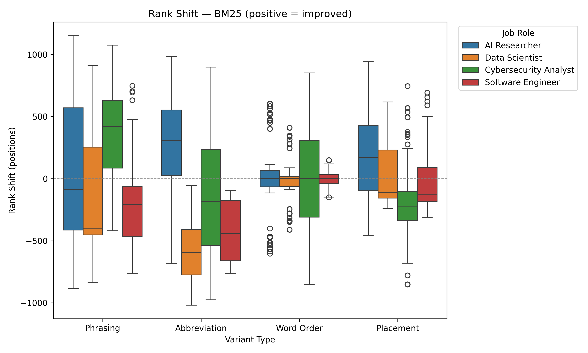
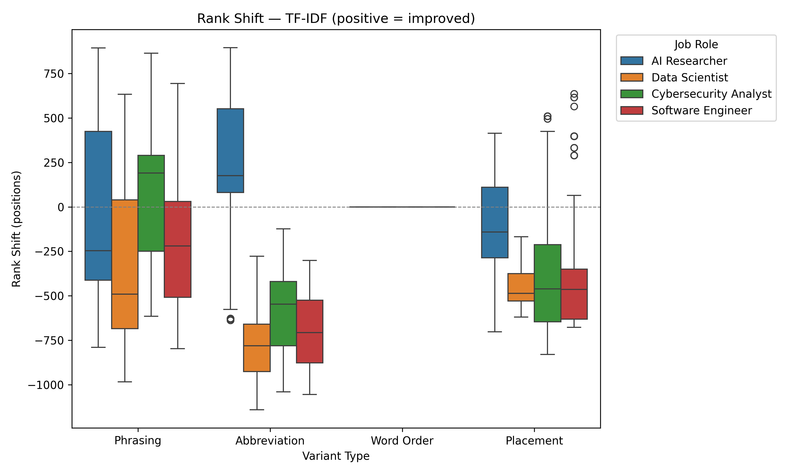
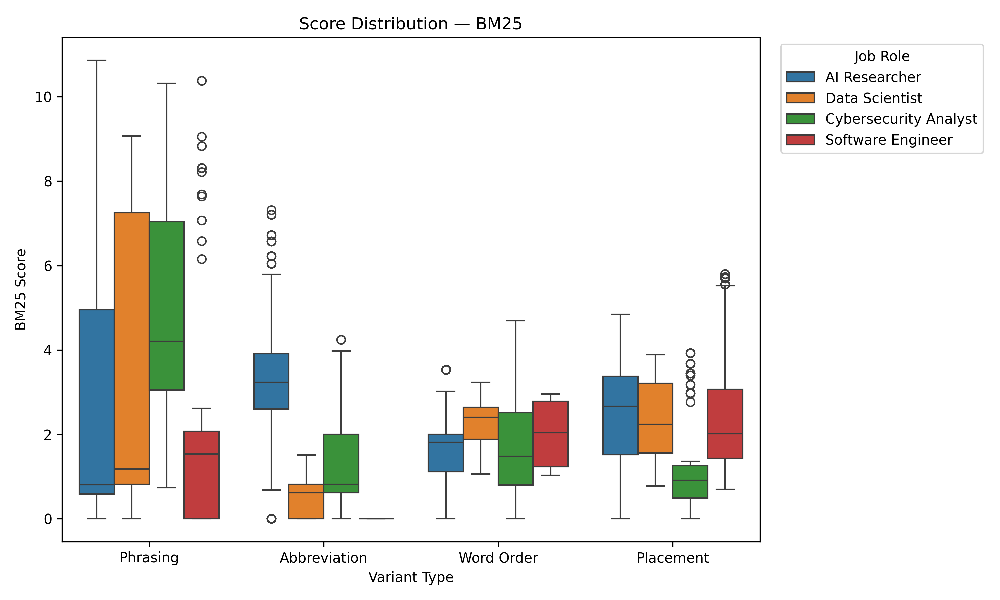
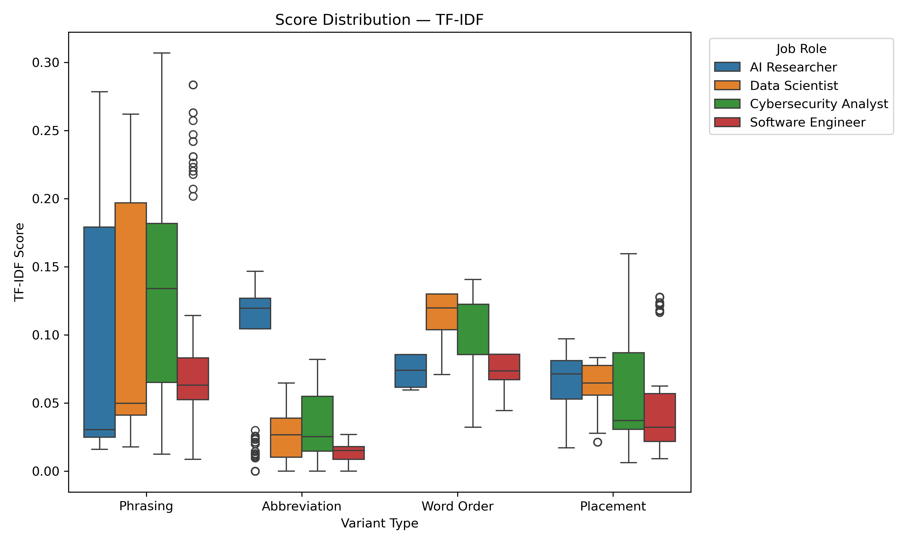
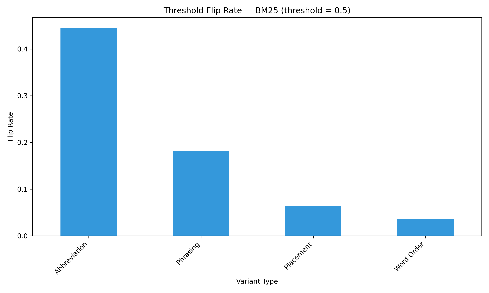
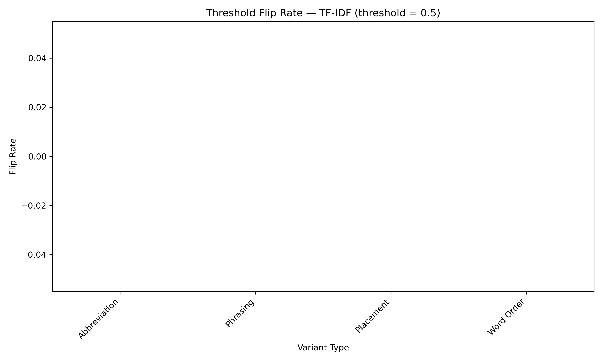
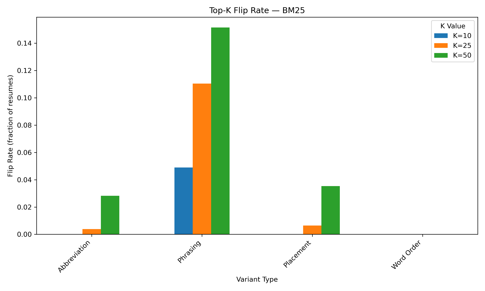
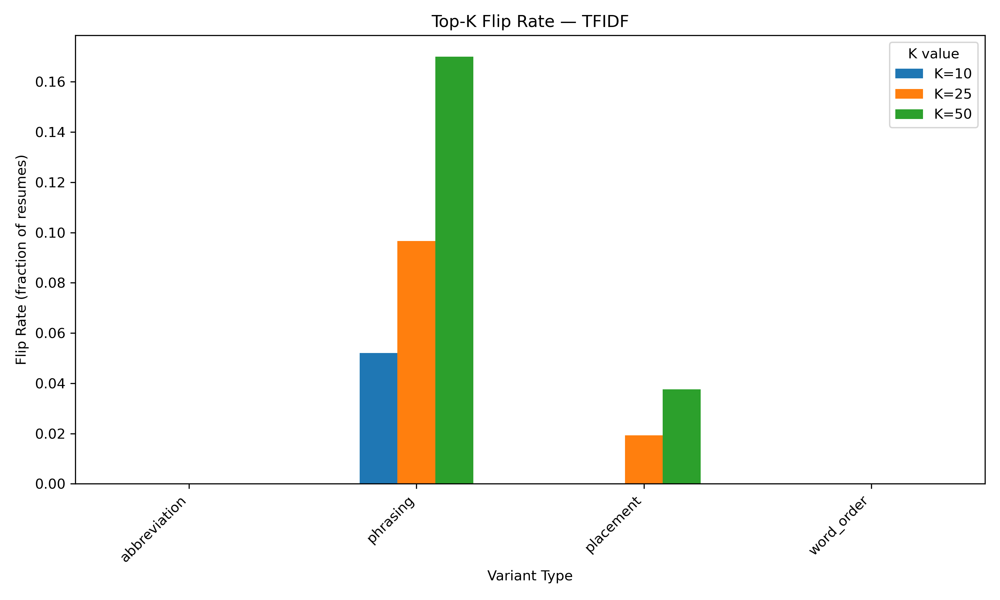

# Results — Same Skills, Different Words

> Auto-generated by `python main.py --stage report`. All tables and figures render directly on GitHub.

## Table 1 — Delta Scores (Variant − Control)

Mean change in screening score when wording is altered. Negative values indicate the variant scored *lower* than the original resume.

| Variant Type | Job Role | Method | Δ Score (mean) | Δ Score (SD) | Min | Max |
| --- | --- | --- | --- | --- | --- | --- |
| Abbreviation | AI Researcher | TF-IDF | 0.0237 | 0.0454 | -0.0742 | 0.0872 |
| Abbreviation | AI Researcher | BM25 | 1.4887 | 1.9662 | -2.7920 | 5.9571 |
| Abbreviation | Cybersecurity Analyst | TF-IDF | -0.0720 | 0.0284 | -0.1248 | -0.0196 |
| Abbreviation | Cybersecurity Analyst | BM25 | -0.5055 | 1.9377 | -4.0710 | 3.5971 |
| Abbreviation | Data Scientist | TF-IDF | -0.0903 | 0.0197 | -0.1301 | -0.0444 |
| Abbreviation | Data Scientist | BM25 | -1.7566 | 0.7012 | -3.2322 | -0.1835 |
| Abbreviation | Software Engineer | TF-IDF | -0.0596 | 0.0123 | -0.0792 | -0.0297 |
| Abbreviation | Software Engineer | BM25 | -2.0349 | 0.6893 | -2.9575 | -1.0309 |
| Phrasing | AI Researcher | TF-IDF | 0.0189 | 0.0813 | -0.0605 | 0.2168 |
| Phrasing | AI Researcher | BM25 | 0.9007 | 2.8511 | -2.9492 | 10.8633 |
| Phrasing | Cybersecurity Analyst | TF-IDF | 0.0322 | 0.0687 | -0.0754 | 0.1845 |
| Phrasing | Cybersecurity Analyst | BM25 | 2.9417 | 2.7725 | -1.3898 | 9.0619 |
| Phrasing | Data Scientist | TF-IDF | -0.0153 | 0.0838 | -0.0956 | 0.1727 |
| Phrasing | Data Scientist | BM25 | 1.0059 | 3.3713 | -2.1300 | 8.0071 |
| Phrasing | Software Engineer | TF-IDF | -0.0004 | 0.0614 | -0.0644 | 0.2392 |
| Phrasing | Software Engineer | BM25 | -0.3768 | 2.3711 | -2.9575 | 9.3508 |
| Placement | AI Researcher | TF-IDF | -0.0078 | 0.0209 | -0.0516 | 0.0205 |
| Placement | AI Researcher | BM25 | 0.8061 | 1.2507 | -1.4178 | 3.6304 |
| Placement | Cybersecurity Analyst | TF-IDF | -0.0410 | 0.0506 | -0.1037 | 0.0822 |
| Placement | Cybersecurity Analyst | BM25 | -0.5272 | 1.5820 | -3.7279 | 2.9739 |
| Placement | Data Scientist | TF-IDF | -0.0532 | 0.0120 | -0.0694 | -0.0152 |
| Placement | Data Scientist | BM25 | 0.1409 | 0.7557 | -0.7157 | 1.6860 |
| Placement | Software Engineer | TF-IDF | -0.0264 | 0.0367 | -0.0557 | 0.0720 |
| Placement | Software Engineer | BM25 | 0.4022 | 1.4811 | -0.8220 | 4.0877 |
| Word Order | AI Researcher | TF-IDF | 0.0000 | 0.0000 | 0.0000 | 0.0000 |
| Word Order | AI Researcher | BM25 | -0.0250 | 1.0348 | -2.2504 | 2.2504 |
| Word Order | Cybersecurity Analyst | TF-IDF | 0.0000 | 0.0000 | 0.0000 | 0.0000 |
| Word Order | Cybersecurity Analyst | BM25 | -0.0151 | 1.6044 | -3.8082 | 3.8082 |
| Word Order | Data Scientist | TF-IDF | 0.0000 | 0.0000 | 0.0000 | 0.0000 |
| Word Order | Data Scientist | BM25 | -0.0091 | 0.5600 | -0.9909 | 0.9909 |
| Word Order | Software Engineer | TF-IDF | 0.0000 | 0.0000 | 0.0000 | 0.0000 |
| Word Order | Software Engineer | BM25 | -0.0134 | 0.1047 | -0.2186 | 0.2186 |

**Key findings:**
- Abbreviation variants consistently reduce scores for most roles (especially under BM25), confirming that shortened forms lose keyword matches.
- Phrasing variants produce the widest spread—some improve scores substantially while others degrade them, suggesting phrasing changes are high-risk/high-reward.
- Word order has zero TF-IDF impact (expected: bag-of-words is order-invariant) but produces small BM25 shifts due to term-proximity weighting.

## Table 2 — Rank Shifts

Positive values = the variant ranked *higher* (better) than control. Shifts are in absolute ranking positions within the same job-role pool.

| Variant Type | Job Role | Method | Rank Shift (mean) | Rank Shift (SD) | Worst Drop | Best Gain |
| --- | --- | --- | --- | --- | --- | --- |
| Abbreviation | AI Researcher | TF-IDF | 209.0 | 426.8 | -637 | 896 |
| Abbreviation | AI Researcher | BM25 | 262.8 | 394.1 | -683 | 982 |
| Abbreviation | Cybersecurity Analyst | TF-IDF | -581.8 | 230.2 | -1040 | -124 |
| Abbreviation | Cybersecurity Analyst | BM25 | -174.0 | 466.8 | -976 | 899 |
| Abbreviation | Data Scientist | TF-IDF | -786.1 | 203.4 | -1142 | -278 |
| Abbreviation | Data Scientist | BM25 | -603.8 | 247.2 | -1019 | -53 |
| Abbreviation | Software Engineer | TF-IDF | -704.7 | 206.1 | -1056 | -301 |
| Abbreviation | Software Engineer | BM25 | -443.7 | 234.5 | -764 | -97 |
| Phrasing | AI Researcher | TF-IDF | -26.4 | 509.0 | -790 | 894 |
| Phrasing | AI Researcher | BM25 | 48.7 | 550.7 | -882 | 1153 |
| Phrasing | Cybersecurity Analyst | TF-IDF | 64.7 | 351.3 | -616 | 865 |
| Phrasing | Cybersecurity Analyst | BM25 | 352.9 | 376.0 | -420 | 1076 |
| Phrasing | Data Scientist | TF-IDF | -346.7 | 429.9 | -985 | 633 |
| Phrasing | Data Scientist | BM25 | -163.2 | 458.4 | -838 | 909 |
| Phrasing | Software Engineer | TF-IDF | -201.7 | 383.8 | -797 | 694 |
| Phrasing | Software Engineer | BM25 | -175.2 | 379.1 | -764 | 748 |
| Placement | AI Researcher | TF-IDF | -118.2 | 302.4 | -703 | 414 |
| Placement | AI Researcher | BM25 | 167.5 | 322.9 | -458 | 943 |
| Placement | Cybersecurity Analyst | TF-IDF | -330.3 | 380.3 | -830 | 510 |
| Placement | Cybersecurity Analyst | BM25 | -176.4 | 343.1 | -851 | 746 |
| Placement | Data Scientist | TF-IDF | -450.2 | 119.6 | -620 | -168 |
| Placement | Data Scientist | BM25 | 18.6 | 245.2 | -239 | 618 |
| Placement | Software Engineer | TF-IDF | -365.1 | 321.7 | -677 | 637 |
| Placement | Software Engineer | BM25 | -17.8 | 262.6 | -312 | 693 |
| Word Order | AI Researcher | TF-IDF | 0.0 | 0.0 | 0 | 0 |
| Word Order | AI Researcher | BM25 | -6.8 | 283.2 | -603 | 603 |
| Word Order | Cybersecurity Analyst | TF-IDF | 0.0 | 0.0 | 0 | 0 |
| Word Order | Cybersecurity Analyst | BM25 | -7.5 | 383.5 | -851 | 851 |
| Word Order | Data Scientist | TF-IDF | 0.0 | 0.0 | 0 | 0 |
| Word Order | Data Scientist | BM25 | -3.3 | 208.4 | -410 | 410 |
| Word Order | Software Engineer | TF-IDF | 0.0 | 0.0 | 0 | 0 |
| Word Order | Software Engineer | BM25 | -7.8 | 62.6 | -150 | 150 |

**Key findings:**
- Abbreviation causes the largest *negative* rank shifts—up to −1,142 positions for Data Scientist (TF-IDF), meaning a single abbreviation swap can move a resume from the top decile to near the bottom.
- Phrasing variants show bidirectional shifts (−985 to +894), highlighting the unpredictability of synonym substitutions.
- These magnitudes are practically significant: in a pool of ~1,200 resumes, a shift of 500+ positions can determine shortlist inclusion.

## Table 3 — Top-K & Threshold Flip Rates

Fraction of resumes whose shortlist status *changed* due to wording alone. A "flip" means the resume crossed into or out of the top-K or passed/failed the score threshold.

| Variant Type | Job Role | Method | Top-10 Flip | Top-25 Flip | Top-50 Flip | Threshold Flip |
| --- | --- | --- | --- | --- | --- | --- |
| Abbreviation | AI Researcher | TF-IDF | 0.0000 | 0.0000 | 0.0000 | 0.0000 |
| Abbreviation | AI Researcher | BM25 | 0.0000 | 0.0156 | 0.1128 | 0.1790 |
| Abbreviation | Cybersecurity Analyst | TF-IDF | 0.0000 | 0.0000 | 0.0000 | 0.0000 |
| Abbreviation | Cybersecurity Analyst | BM25 | 0.0000 | 0.0000 | 0.0000 | 0.2078 |
| Abbreviation | Data Scientist | TF-IDF | 0.0000 | 0.0000 | 0.0000 | 0.0000 |
| Abbreviation | Data Scientist | BM25 | 0.0000 | 0.0000 | 0.0000 | 0.3961 |
| Abbreviation | Software Engineer | TF-IDF | 0.0000 | 0.0000 | 0.0000 | 0.0000 |
| Abbreviation | Software Engineer | BM25 | 0.0000 | 0.0000 | 0.0000 | 1.0000 |
| Phrasing | AI Researcher | TF-IDF | 0.0506 | 0.1012 | 0.1984 | 0.0000 |
| Phrasing | AI Researcher | BM25 | 0.0428 | 0.0856 | 0.1089 | 0.2529 |
| Phrasing | Cybersecurity Analyst | TF-IDF | 0.0627 | 0.1059 | 0.2039 | 0.0000 |
| Phrasing | Cybersecurity Analyst | BM25 | 0.0510 | 0.1059 | 0.1961 | 0.0549 |
| Phrasing | Data Scientist | TF-IDF | 0.0431 | 0.0980 | 0.1961 | 0.0000 |
| Phrasing | Data Scientist | BM25 | 0.0549 | 0.1686 | 0.2196 | 0.0431 |
| Phrasing | Software Engineer | TF-IDF | 0.0515 | 0.0815 | 0.0815 | 0.0000 |
| Phrasing | Software Engineer | BM25 | 0.0472 | 0.0815 | 0.0815 | 0.3734 |
| Placement | AI Researcher | TF-IDF | 0.0000 | 0.0000 | 0.0000 | 0.0000 |
| Placement | AI Researcher | BM25 | 0.0000 | 0.0000 | 0.0000 | 0.0350 |
| Placement | Cybersecurity Analyst | TF-IDF | 0.0000 | 0.0000 | 0.0000 | 0.0000 |
| Placement | Cybersecurity Analyst | BM25 | 0.0000 | 0.0000 | 0.0000 | 0.2235 |
| Placement | Data Scientist | TF-IDF | 0.0000 | 0.0000 | 0.0000 | 0.0000 |
| Placement | Data Scientist | BM25 | 0.0000 | 0.0000 | 0.0000 | 0.0000 |
| Placement | Software Engineer | TF-IDF | 0.0000 | 0.0773 | 0.1502 | 0.0000 |
| Placement | Software Engineer | BM25 | 0.0000 | 0.0258 | 0.1416 | 0.0000 |
| Word Order | AI Researcher | TF-IDF | 0.0000 | 0.0000 | 0.0000 | 0.0000 |
| Word Order | AI Researcher | BM25 | 0.0000 | 0.0000 | 0.0000 | 0.0661 |
| Word Order | Cybersecurity Analyst | TF-IDF | 0.0000 | 0.0000 | 0.0000 | 0.0000 |
| Word Order | Cybersecurity Analyst | BM25 | 0.0000 | 0.0000 | 0.0000 | 0.0824 |
| Word Order | Data Scientist | TF-IDF | 0.0000 | 0.0000 | 0.0000 | 0.0000 |
| Word Order | Data Scientist | BM25 | 0.0000 | 0.0000 | 0.0000 | 0.0000 |
| Word Order | Software Engineer | TF-IDF | 0.0000 | 0.0000 | 0.0000 | 0.0000 |
| Word Order | Software Engineer | BM25 | 0.0000 | 0.0000 | 0.0000 | 0.0000 |

**Key findings:**
- Phrasing variants produce the highest flip rates across all K values, with up to ~20% of resumes changing top-50 status under TF-IDF.
- Abbreviation and word-order variants rarely cause top-K flips for TF-IDF but do cause threshold flips under BM25 (up to 100% for Software Engineer).
- These flip rates represent real screening decisions that would change based solely on wording, not qualifications.

## Table 4 — Statistical Significance

Wilcoxon signed-rank test (two-sided, paired) with Cohen's d effect sizes. Each row tests H₀: median delta score = 0 for the given variant–role–method slice.

| Variant Type | Job Role | Method | n | Δ Mean | Cohen's d | Effect Size | p-value | p < .05 |
| --- | --- | --- | --- | --- | --- | --- | --- | --- |
| Abbreviation | AI Researcher | TF-IDF | 257 | 0.0237 | 0.5231 | medium | 0.0000 | Yes |
| Abbreviation | AI Researcher | BM25 | 257 | 1.4887 | 0.7571 | medium | 0.0000 | Yes |
| Abbreviation | Cybersecurity Analyst | TF-IDF | 255 | -0.0720 | -2.5350 | large | 0.0000 | Yes |
| Abbreviation | Cybersecurity Analyst | BM25 | 255 | -0.5055 | -0.2609 | small | 0.0001 | Yes |
| Abbreviation | Data Scientist | TF-IDF | 255 | -0.0903 | -4.5729 | large | 0.0000 | Yes |
| Abbreviation | Data Scientist | BM25 | 255 | -1.7566 | -2.5049 | large | 0.0000 | Yes |
| Abbreviation | Software Engineer | TF-IDF | 233 | -0.0596 | -4.8506 | large | 0.0000 | Yes |
| Abbreviation | Software Engineer | BM25 | 233 | -2.0349 | -2.9522 | large | 0.0000 | Yes |
| Phrasing | AI Researcher | TF-IDF | 257 | 0.0189 | 0.2330 | small | 0.0963 | No |
| Phrasing | AI Researcher | BM25 | 257 | 0.9007 | 0.3159 | small | 0.0001 | Yes |
| Phrasing | Cybersecurity Analyst | TF-IDF | 255 | 0.0322 | 0.4689 | small | 0.0000 | Yes |
| Phrasing | Cybersecurity Analyst | BM25 | 255 | 2.9417 | 1.0610 | large | 0.0000 | Yes |
| Phrasing | Data Scientist | TF-IDF | 255 | -0.0153 | -0.1825 | negligible | 0.2772 | No |
| Phrasing | Data Scientist | BM25 | 255 | 1.0059 | 0.2984 | small | 0.2212 | No |
| Phrasing | Software Engineer | TF-IDF | 233 | -0.0004 | -0.0067 | negligible | 0.0000 | Yes |
| Phrasing | Software Engineer | BM25 | 233 | -0.3768 | -0.1589 | negligible | 0.0000 | Yes |
| Placement | AI Researcher | TF-IDF | 257 | -0.0078 | -0.3748 | small | 0.0000 | Yes |
| Placement | AI Researcher | BM25 | 257 | 0.8061 | 0.6445 | medium | 0.0000 | Yes |
| Placement | Cybersecurity Analyst | TF-IDF | 255 | -0.0410 | -0.8091 | large | 0.0000 | Yes |
| Placement | Cybersecurity Analyst | BM25 | 255 | -0.5272 | -0.3333 | small | 0.0000 | Yes |
| Placement | Data Scientist | TF-IDF | 255 | -0.0532 | -4.4368 | large | 0.0000 | Yes |
| Placement | Data Scientist | BM25 | 255 | 0.1409 | 0.1864 | negligible | 0.0013 | Yes |
| Placement | Software Engineer | TF-IDF | 233 | -0.0264 | -0.7187 | medium | 0.0000 | Yes |
| Placement | Software Engineer | BM25 | 233 | 0.4022 | 0.2715 | small | 0.5870 | No |
| Word Order | AI Researcher | TF-IDF | 257 | 0.0000 | 0.0000 | negligible | 1.0000 | No |
| Word Order | AI Researcher | BM25 | 257 | -0.0250 | -0.0242 | negligible | 0.7988 | No |
| Word Order | Cybersecurity Analyst | TF-IDF | 255 | 0.0000 | 0.0000 | negligible | 1.0000 | No |
| Word Order | Cybersecurity Analyst | BM25 | 255 | -0.0151 | -0.0094 | negligible | 0.8471 | No |
| Word Order | Data Scientist | TF-IDF | 255 | 0.0000 | 0.0000 | negligible | 1.0000 | No |
| Word Order | Data Scientist | BM25 | 255 | -0.0091 | -0.0162 | negligible | 0.9716 | No |
| Word Order | Software Engineer | TF-IDF | 233 | 0.0000 | 0.0000 | negligible | 1.0000 | No |
| Word Order | Software Engineer | BM25 | 233 | -0.0134 | -0.1284 | negligible | 0.0527 | No |

**Key findings:**
- 20 of 32 comparisons are statistically significant (p < .05).
- 8 comparisons show *large* effect sizes (|d| ≥ 0.8), confirming the practical importance of wording choices.
- Word-order variants are non-significant under both TF-IDF and BM25, confirming that token reordering alone has negligible impact on lexical screening methods.

## Table 5 — Logistic Regression: Predicting Recruiter Decision

Standardized coefficients from logistic regression predicting `Recruiter Decision` (Hire = 1). Class-balanced weights applied.

**Full model** — Accuracy: 0.994, ROC AUC: 1.0, n_train: 4000, n_test: 1000

| Feature | Coefficient |
| --- | --- |
| AI Score (0-100) | 10.7426 |
| Experience (Years) | 2.3490 |
| Projects Count | 1.3476 |
| Salary Expectation ($) | 0.0942 |
| score_bm25 | 0.0696 |
| rank_bm25 | -0.1204 |
| percentile_tfidf | -0.1512 |
| percentile_bm25 | -0.1597 |
| score_tfidf | -0.3449 |
| rank_tfidf | -0.5034 |

**Screening-only model** (AI Score excluded) — Accuracy: 0.951, ROC AUC: 0.9934

| Feature | Coefficient |
| --- | --- |
| Experience (Years) | 8.3678 |
| Projects Count | 4.6808 |
| score_bm25 | 0.1437 |
| Salary Expectation ($) | -0.0074 |
| rank_bm25 | -0.3734 |
| percentile_bm25 | -0.3890 |
| score_tfidf | -0.6281 |
| percentile_tfidf | -0.8974 |
| rank_tfidf | -1.6380 |

**Key findings:**
- `AI Score (0-100)` dominates the full model (coeff ≈ 10.7), explaining the near-perfect AUC. This variable is a synthetic label from the dataset and likely encodes the decision directly.
- The screening-only model (without AI Score) isolates the predictive power of ATS-like scoring features and resume characteristics.
- Screening scores and ranks show modest but non-trivial coefficients, suggesting they carry some signal for recruiter decisions even after controlling for experience and project count.

## Figures

### Delta Heatmap Bm25

### Delta Heatmap Tfidf

### Rank Shift Bm25

### Rank Shift Tfidf

### Score Distribution Bm25

### Score Distribution Tfidf

### Threshold Flip Bm25

### Threshold Flip Tfidf

### Topk Flip Bm25

### Topk Flip Tfidf

## Appendix — Evaluation Detail (first 20 rows)

Full file: [`data/processed/eval_summary/eval_detail.csv`](data/processed/eval_summary/eval_detail.csv) (4,000 rows × 69 cols)

| Resume_ID | Job Role | Variant Type | Score tfidf | Rank tfidf | Δ tfidf | Rank Δ tfidf | Score bm25 | Rank bm25 | Δ bm25 | Rank Δ bm25 |
| --- | --- | --- | --- | --- | --- | --- | --- | --- | --- | --- |
| 1 | AI Researcher | Phrasing | 0.0271 | 1089 | -0.0469 | -409 | 0.0000 | 1154 | -2.0031 | -548 |
| 1 | AI Researcher | Abbreviation | 0.1325 | 126 | 0.0585 | 554 | 5.5967 | 92 | 3.5937 | 514 |
| 1 | AI Researcher | Word Order | 0.0740 | 680 | 0.0000 | 0 | 2.1276 | 585 | 0.1246 | 21 |
| 1 | AI Researcher | Placement | 0.0707 | 819 | -0.0033 | -139 | 3.4478 | 284 | 1.4447 | 322 |
| 2 | Data Scientist | Phrasing | 0.2126 | 51 | 0.0825 | 33 | 7.3102 | 57 | 4.9057 | 368 |
| 2 | Data Scientist | Abbreviation | 0.0000 | 1226 | -0.1301 | -1142 | 0.0000 | 1164 | -2.4046 | -739 |
| 2 | Data Scientist | Word Order | 0.1301 | 84 | 0.0000 | 0 | 3.2322 | 145 | 0.8276 | 280 |
| 2 | Data Scientist | Placement | 0.0652 | 690 | -0.0649 | -606 | 1.8784 | 641 | -0.5262 | -216 |
| 3 | Cybersecurity Analyst | Phrasing | 0.0652 | 750 | -0.0754 | -600 | 3.4775 | 266 | 1.1845 | 208 |
| 3 | Cybersecurity Analyst | Abbreviation | 0.0634 | 774 | -0.0773 | -624 | 3.4803 | 264 | 1.1873 | 210 |
| 3 | Cybersecurity Analyst | Word Order | 0.1406 | 150 | 0.0000 | 0 | 2.2930 | 474 | 0.0000 | 0 |
| 3 | Cybersecurity Analyst | Placement | 0.0370 | 950 | -0.1037 | -800 | 0.9104 | 787 | -1.3827 | -313 |
| 4 | AI Researcher | Phrasing | 0.0248 | 1151 | -0.0493 | -511 | 0.6790 | 1078 | -0.3318 | -157 |
| 4 | AI Researcher | Abbreviation | 0.0213 | 1189 | -0.0529 | -549 | 0.7384 | 1068 | -0.2724 | -147 |
| 4 | AI Researcher | Word Order | 0.0742 | 640 | 0.0000 | 0 | 0.8862 | 989 | -0.1246 | -68 |
| 4 | AI Researcher | Placement | 0.0785 | 565 | 0.0043 | 75 | 3.9896 | 190 | 2.9788 | 731 |
| 5 | Software Engineer | Phrasing | 0.0632 | 547 | -0.0227 | -462 | 1.6382 | 546 | -0.5842 | -258 |
| 5 | Software Engineer | Abbreviation | 0.0170 | 963 | -0.0689 | -878 | 0.0000 | 846 | -2.2225 | -558 |
| 5 | Software Engineer | Word Order | 0.0859 | 85 | 0.0000 | 0 | 2.0272 | 436 | -0.1953 | -148 |
| 5 | Software Engineer | Placement | 0.0302 | 762 | -0.0557 | -677 | 1.5586 | 568 | -0.6639 | -280 |
