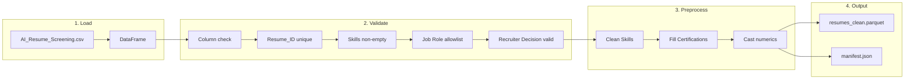

# Data Ingestion Plan

**Ingestion specification for the Same Skills, Different Words pipeline**

Input: `Dataset/AI_Resume_Screening.csv`  
Output: `data/processed/resumes_clean.parquet`  
See [pipeline plan.md](pipeline%20plan.md) and [pipeline outputs.md](pipeline%20outputs.md) for context.

---

## 1. Source & Acquisition

| Item | Detail |
|------|--------|
| **Source** | Kaggle: AI Resume Screening dataset |
| **Path** | `Dataset/AI_Resume_Screening.csv` |
| **License** | Kaggle dataset terms apply; cite source in publications |
| **Do not mutate** | Raw data is immutable; all transformations produce new artifacts |

---

## 2. Schema (Expected vs Actual)

| Column | Type | Role | Notes |
|--------|------|------|-------|
| Resume_ID | int64 | Identifier | Primary key; must be unique |
| Name | object | Metadata | Not used in scoring; kept for traceability |
| Skills | object | **Treatment** | Comma-separated; primary target for variant generation |
| Experience (Years) | int64 | Supplemental | Used for stratification / control |
| Education | object | Supplemental | B.Sc, MBA, B.Tech, M.Tech, PhD |
| Certifications | object | Supplemental | 274 nulls (27.4%); fill with empty string |
| Job Role | object | **Stratification** | AI Researcher, Data Scientist, Cybersecurity Analyst, Software Engineer |
| Recruiter Decision | object | **Outcome** | Hire / Reject; ground truth for logistic regression |
| Salary Expectation ($) | int64 | Supplemental | 40K–120K range |
| Projects Count | int64 | Supplemental | 0–10+ |
| AI Score (0-100) | int64 | Supplemental | Pre-computed; 15–100, median 100 |

**Current stats:** 1000 rows, 11 columns. No duplicates on Resume_ID. Certifications has 274 nulls (string `"None"` or NaN).

---

## 3. Ingestion Pipeline



### 3.1 Load

1. Read CSV with `pd.read_csv()`; encoding `utf-8`.
2. Validate required columns exist; fail fast if any missing.
3. Log: row count, file size, optional checksum (MD5/SHA256).

### 3.2 Validation

| Check | Action on failure |
|-------|-------------------|
| Resume_ID unique | Log duplicate IDs; drop duplicates keeping first |
| Skills non-empty | Log; exclude row from downstream (or raise if > threshold) |
| Job Role in allowlist | Log unknown roles; map or exclude per config |
| Recruiter Decision in {Hire, Reject} | Log; exclude invalid |
| No all-null rows | Drop |

**Job Role allowlist:** AI Researcher, Data Scientist, Cybersecurity Analyst, Software Engineer

### 3.3 Preprocessing

| Step | Detail |
|------|--------|
| **Skills** | Strip whitespace; normalize internal commas (no extra spaces); preserve order. Do *not* correct typos (e.g. "Pytorch") in raw—variant generator handles expansions. |
| **Certifications** | Replace null/NaN and literal "None" with `""` for downstream text concatenation. |
| **Education** | No transformation; categorical as-is. |
| **Experience, Salary, Projects, AI Score** | Cast to int; handle float coercion. |
| **Name** | Strip leading/trailing whitespace. |

### 3.4 Derived Fields (Optional)

| Field | Type | Definition |
|-------|------|-------------|
| skills_list | list[str] | Split Skills on comma, strip each |
| skills_count | int64 | len(skills_list) |
| text_concat | str | Skills + " " + Education + " " + Certifications (optional for full-doc scoring) |

### 3.5 Output

- Write to `data/processed/resumes_clean.parquet`.
- Preserve all original columns plus derived fields.
- Write run manifest to `outputs/<timestamp>/manifest.json`: config path, seed, input file + hash/size, output path, git commit.

---

## 4. Edge Cases & Decisions

| Case | Decision |
|------|----------|
| Skills with "None" literal | Treat as empty; exclude from variant generation or flag. |
| Skills with special chars | Preserve; no aggressive normalization beyond strip. |
| Very long skill strings | Keep; downstream tokenizers handle. |
| Multiple Education / Cert values | Single value per row in this dataset. |
| Encoding issues | Fail with clear error; do not silent replace. |

---

## 5. Run Manifest (Reproducibility)

```json
{
  "run_id": "<timestamp>",
  "config": "configs/default.yaml",
  "seed": 42,
  "input": {
    "path": "Dataset/AI_Resume_Screening.csv",
    "size_bytes": 123456,
    "rows": 1000,
    "hash": "sha256:..."
  },
  "outputs": ["data/processed/resumes_clean.parquet"],
  "git_commit": "abc1234"
}
```

---

## 6. Downstream Dependencies

| Consumer | Expects |
|----------|---------|
| variant_generator | resumes_clean.parquet with Skills, Resume_ID, Job Role |
| scoring | Job Role for per-role queries; Skills (and optional text_concat) for document representation |
| evaluation | Pairs control vs variant by Resume_ID + variant_type |

---

## 7. Module Mapping

| Stage | Module | Responsibility |
|-------|--------|----------------|
| Load | data_loader.py | Read CSV, column validation, checksum |
| Preprocess | preprocessing.py | Clean text, fill nulls, cast types, validation |
| Orchestration | main.py | Chain load → preprocess, write manifest |
