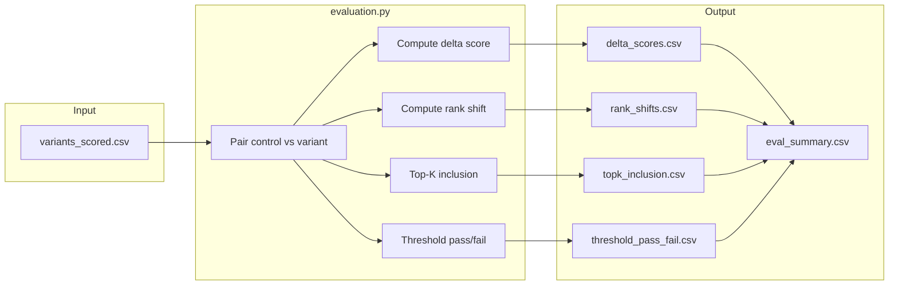

# Evaluation Plan

**Evaluation specification for the Same Skills, Different Words pipeline**

Defines how lexical-variation effects are measured and reported. Input: `variants_scored.csv`. Output: `data/processed/eval_summary/`. See [pipeline plan.md](pipeline%20plan.md) and [pipeline outputs.md](pipeline%20outputs.md).

---

## 1. Evaluation Scope

### 1.1 Design Principle

**Paired comparison:** For each resume, compare control (original wording) vs. variant (modified wording) under identical conditions—same job role, same JD query, same screening method. Only the Skills text changes; all other resume attributes are held constant.

### 1.2 Unit of Analysis

- **Pair:** (Resume_ID, variant_type) — control baseline vs. each variant type
- **Stratification:** job_role, screening_method (tfidf, bm25, embedding)

---

## 2. Research Question Mapping

| RQ | Question | Metrics | Stratification |
|----|----------|---------|----------------|
| RQ1 | Do wording variations significantly change scores and rankings? | Δ score, rank shift | variant_type, job_role, method |
| RQ2 | Which variation types produce the largest rank shifts? | rank_shift (mean, median, distribution) | variant_type |
| RQ3 | Are effects consistent across roles and methods? | Cross-tabs: variant_type × job_role, variant_type × method | job_role, method |

---

## 3. Metrics Definition

| Metric | Definition | Interpretation |
|--------|------------|----------------|
| **Δ Score** | `score_variant − score_control` | Positive = variant scored higher; zero = no change |
| **Rank Shift** | `rank_variant − rank_control` | Negative = variant moved up; zero = no change |
| **Top-K Inclusion** | Binary: variant in top-K within job_role | 1 = entered shortlist; 0 = did not |
| **Threshold Pass/Fail** | Binary: score_variant ≥ threshold | 1 = passed cutoff; 0 = failed |

### 3.1 Configurable Parameters

| Parameter | Default | Purpose |
|-----------|---------|---------|
| topk_values | [10, 25, 50] | K for shortlist inclusion |
| score_thresholds | [0.5, 0.6, 0.7] | Match-score cutoffs (normalized 0–1) |
| methods | [tfidf, bm25] | Screening methods to evaluate |
| variant_types | [phrasing, abbreviation, word_order, placement] | Variant types (excludes control) |

---

## 4. Evaluation Pipeline



### 4.1 Steps

1. **Load** `variants_scored.csv`; ensure control row exists for each Resume_ID.
2. **Pair:** For each (Resume_ID, variant_type), join control row by Resume_ID + job_role.
3. **Compute** Δ score, rank shift per (Resume_ID, variant_type, job_role, method).
4. **Aggregate** top-K and threshold metrics.
5. **Summarize** by variant_type, job_role, method (mean, median, std, count).

---

## 5. Output Schema

### 5.1 delta_scores.csv

| Column | Type | Description |
|--------|------|-------------|
| Resume_ID | int | Resume identifier |
| variant_type | str | phrasing, abbreviation, word_order, placement |
| job_role | str | AI Researcher, Data Scientist, etc. |
| method | str | tfidf, bm25, embedding |
| delta_score | float | score_variant − score_control |
| score_control | float | Control score |
| score_variant | float | Variant score |

### 5.2 rank_shifts.csv

| Column | Type | Description |
|--------|------|-------------|
| Resume_ID | int | Resume identifier |
| variant_type | str | Variant type |
| job_role | str | Job role |
| method | str | Screening method |
| rank_shift | int | rank_variant − rank_control |
| rank_control | int | Control rank (1 = top) |
| rank_variant | int | Variant rank |

### 5.3 topk_inclusion.csv

| Column | Type | Description |
|--------|------|-------------|
| Resume_ID | int | Resume identifier |
| variant_type | str | Variant type |
| job_role | str | Job role |
| method | str | Screening method |
| in_top10 | bool | 1 if variant in top 10 |
| in_top25 | bool | 1 if variant in top 25 |
| in_top50 | bool | 1 if variant in top 50 |
| control_in_top10 | bool | 1 if control in top 10 |
| control_in_top25 | bool | 1 if control in top 25 |
| control_in_top50 | bool | 1 if control in top 50 |

### 5.4 threshold_pass_fail.csv

| Column | Type | Description |
|--------|------|-------------|
| Resume_ID | int | Resume identifier |
| variant_type | str | Variant type |
| job_role | str | Job role |
| method | str | Screening method |
| threshold | float | Cutoff value (e.g. 0.6) |
| pass_variant | bool | 1 if score_variant ≥ threshold |
| pass_control | bool | 1 if score_control ≥ threshold |

### 5.5 eval_summary.csv (aggregated)

| Column | Type | Description |
|--------|------|-------------|
| variant_type | str | Variant type |
| job_role | str | Job role (or "all") |
| method | str | Screening method |
| metric | str | delta_score, rank_shift, in_top10, etc. |
| mean | float | Mean value |
| median | float | Median value |
| std | float | Standard deviation |
| count | int | Number of pairs |

---

## 6. Statistical Reporting

For RQ1–RQ3, report:

| Statistic | Use |
|-----------|-----|
| Mean Δ score by variant_type | Effect magnitude |
| Median rank shift by variant_type | Robustness to outliers |
| % change in top-K inclusion | Practical impact (shortlist) |
| % change in threshold pass rate | Cutoff sensitivity |
| Cross-tabs variant_type × job_role | RQ3: consistency across roles |
| Cross-tabs variant_type × method | RQ3: lexical vs. semantic |

---

## 7. Phase 2 — Mitigation Evaluation

Before/after comparison when applying wording guidance:

| Metric | Before | After |
|--------|--------|-------|
| Mean rank (variant) | Rank with original wording | Rank after applying guidance |
| Top-K inclusion rate | % in top-K before | % in top-K after |
| Threshold pass rate | % passing before | % passing after |

Output: `data/processed/mitigation_eval.csv` or `reports/mitigation_summary.md`.

---

## 8. Module Mapping

| Responsibility | Module | Config |
|----------------|--------|--------|
| Pair control/variant | evaluation.py | — |
| Compute metrics | evaluation.py | topk_values, score_thresholds |
| Aggregate summaries | evaluation.py | — |
| Write outputs | evaluation.py | output_path |
| Orchestration | main.py | Calls evaluation after scoring |

---

## 9. Config Section (configs/default.yaml)

```yaml
evaluation:
  topk_values: [10, 25, 50]
  score_thresholds: [0.5, 0.6, 0.7]
  methods: [tfidf, bm25]  # add embedding if enabled
  output_dir: data/processed/eval_summary
```
