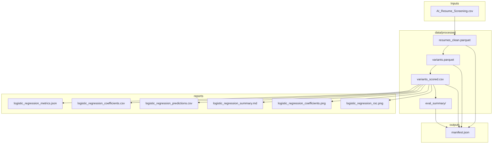

# Pipeline Outputs

**Output artifact specification for the Same Skills, Different Words pipeline**

Complements [pipeline plan.md](pipeline%20plan.md). Documents where outputs go, their format, schema, and purpose.

---

## 1. Output Directory Layout

```
Final_AI_Resume/
├── data/processed/           # Canonical derived artifacts
│   ├── resumes_clean.parquet
│   ├── variants.parquet
│   ├── variants_scored.csv
│   └── eval_summary/        # Evaluation metrics by variant type, role, method
├── outputs/                 # Timestamped run outputs
│   └── <YYYYMMDD_HHMMSS>/
│       ├── manifest.json
│       └── (figures, tables as configured)
└── reports/                 # Analysis summaries and figures
    ├── logistic_regression_metrics.json
    ├── logistic_regression_coefficients.csv
    ├── logistic_regression_predictions.csv
    ├── logistic_regression_summary.md
    ├── logistic_regression_coefficients.png
    └── logistic_regression_roc.png
```

---

## 2. Artifact Specifications

### 2.1 data/processed/resumes_clean.parquet

| Attribute | Value |
|-----------|-------|
| **Producer** | preprocessing.py (via data_loader → preprocessing) |
| **Format** | Apache Parquet |
| **Purpose** | Cleaned, validated resumes ready for variant generation |

**Columns (extends raw schema):**

| Column | Type | Notes |
|--------|------|-------|
| Resume_ID | int64 | Unique identifier |
| Name | str | Metadata |
| Skills | str | Stripped; comma-separated |
| Experience (Years) | int64 | Cast from numeric |
| Education | str | As-is |
| Certifications | str | Nulls filled with `""` |
| Job Role | str | Allowlisted values only |
| Recruiter Decision | str | Hire / Reject |
| Salary Expectation ($) | int64 | Cast from numeric |
| Projects Count | int64 | Cast from numeric |
| AI Score (0-100) | int64 | Cast from numeric |
| skills_list | list[str] | (Optional) Split Skills on comma |
| skills_count | int64 | (Optional) Len of skills_list |
| text_concat | str | (Optional) Skills + Education + Certifications |

---

### 2.2 data/processed/variants.parquet

| Attribute | Value |
|-----------|-------|
| **Producer** | variant_generator.py |
| **Format** | Apache Parquet |
| **Purpose** | Control + lexical variants per resume for scoring |

**Columns (extends resumes_clean):**

| Column | Type | Notes |
|--------|------|-------|
| All resumes_clean columns | — | Carried forward |
| variant_type | str | `control`, `phrasing`, `abbreviation`, `word_order`, `placement` |
| skills_text | str | Modified Skills text for this variant |
| variant_id | str | Unique per Resume_ID + variant_type |

---

### 2.3 data/processed/variants_scored.csv

| Attribute | Value |
|-----------|-------|
| **Producer** | scoring.py |
| **Format** | CSV (UTF-8) |
| **Purpose** | Per-variant scores and ranks for evaluation and logistic regression |

**Columns:**

| Column | Type | Notes |
|--------|------|-------|
| All variant columns | — | Carried forward |
| score_tfidf | float | TF-IDF cosine similarity to JD |
| score_bm25 | float | BM25 score (if enabled) |
| score_embedding | float | Embedding similarity (if enabled) |
| rank_tfidf | int | Per-job-role rank (1 = top) |
| rank_bm25 | int | Per-job-role rank (if BM25 enabled) |
| rank_embedding | int | Per-job-role rank (if embedding enabled) |
| percentile_tfidf | float | Percentile within role |
| percentile_bm25 | float | (if enabled) |
| percentile_embedding | float | (if enabled) |

---

### 2.4 data/processed/eval_summary/

| Attribute | Value |
|-----------|-------|
| **Producer** | evaluation.py |
| **Format** | Directory of CSV/JSON files |
| **Purpose** | Paired comparison metrics: control vs variant |

**Contents (example structure):**

| File | Content |
|------|---------|
| delta_scores.csv | Δ score by variant_type, job_role, method |
| rank_shifts.csv | Rank change (variant − control) by variant_type, job_role |
| topk_inclusion.csv | Binary: did variant enter top-K (K=10, 25, 50) |
| threshold_pass_fail.csv | Pass/fail at configured thresholds |
| eval_summary.csv | Flat summary combining key metrics |

**Metric columns:**

- `delta_score` — variant score − control score
- `rank_shift` — variant rank − control rank (negative = improved)
- `in_top10`, `in_top25`, `in_top50` — boolean
- `pass_threshold` — boolean at configured cutoff

---

### 2.5 outputs/&lt;timestamp&gt;/manifest.json

| Attribute | Value |
|-----------|-------|
| **Producer** | main.py (any pipeline run) |
| **Format** | JSON |
| **Purpose** | Reproducibility record for each run |

**Schema:**

```json
{
  "run_id": "<timestamp>",
  "config": "configs/default.yaml",
  "seed": 42,
  "input": {
    "path": "Dataset/AI_Resume_Screening.csv",
    "size_bytes": 123456,
    "rows": 1000,
    "hash": "sha256:..."
  },
  "outputs": [
    "data/processed/resumes_clean.parquet",
    "data/processed/variants.parquet",
    "data/processed/variants_scored.csv",
    "data/processed/eval_summary/"
  ],
  "git_commit": "abc1234"
}
```

---

### 2.6 reports/ (logistic regression)

| File | Format | Purpose |
|------|--------|---------|
| logistic_regression_metrics.json | JSON | Accuracy, precision, recall, F1, AUC; dataset summary |
| logistic_regression_coefficients.csv | CSV | Feature name, coefficient; interpretability |
| logistic_regression_predictions.csv | CSV | Per-variant: predicted class, probability |
| logistic_regression_summary.md | Markdown | Human-readable summary for report |
| logistic_regression_coefficients.png | PNG | Horizontal bar chart of coefficients (300 DPI) |
| logistic_regression_roc.png | PNG | ROC curve with AUC (300 DPI) |

**Input:** `data/processed/variants_scored.csv`  
**Target:** `Recruiter Decision` (1 = Hire, 0 = Reject)

---

## 3. Output Dependency Summary



---

## 4. Canonical Artifact Paths (reference)

| Artifact | Path |
|----------|------|
| Cleaned resumes | `data/processed/resumes_clean.parquet` |
| Variants | `data/processed/variants.parquet` |
| Scored variants | `data/processed/variants_scored.csv` |
| Evaluation summary | `data/processed/eval_summary/` (or `eval_summary.csv` if flat) |
| Run manifest | `outputs/<timestamp>/manifest.json` |
| Logistic regression | `reports/*.json`, `reports/*.csv`, `reports/*.md`, `reports/*.png` |
