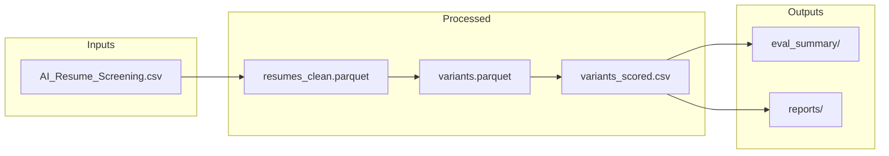

# Pipeline Plan

**Same Skills, Different Words — End-to-End Pipeline Specification**

Synthesized from [README.md](../README.md), [OUTLINE.md](../OUTLINE.md), [Dataset/AI_Resume_Screening.csv](../Dataset/AI_Resume_Screening.csv), and [docs/DATA_INGESTION_PLAN.md](../docs/DATA_INGESTION_PLAN.md).

---

## 1. Overview

### Research Questions

| ID  | Question |
|-----|----------|
| RQ1 | Do wording variations for the same skills significantly change automated screening scores and rankings? |
| RQ2 | Which variation types (phrasing, abbreviation expansion, word order, placement) produce the largest rank shifts? |
| RQ3 | Are wording effects consistent across job roles and screening methods (lexical vs. embedding)? |

### Two-Phase Design

- **Phase 1 — Diagnosis:** Demonstrate and quantify that lexical variation alone changes screening outputs. Generate variants, score/rank them, report effect sizes (Δ score, rank shift, top-K, threshold).
- **Phase 2 — Mitigation:** Evidence-based guidance (abbreviation expansion, dual phrasing, placement) and before/after rank improvements.

---

## 2. Artifact Chain



Canonical chain: `resumes_clean.parquet` → `variants.parquet` → `variants_scored.csv` → `eval_summary/` + `reports/`

---

## 3. Data Pipeline Stages

| Stage | Module | Input | Output | Key Operations |
|-------|--------|------|--------|----------------|
| 1. Load & Validate | data_loader.py | Dataset/AI_Resume_Screening.csv | — | UTF-8 load, column validation, checksum |
| 2. Preprocess | preprocessing.py | Raw CSV | data/processed/resumes_clean.parquet | Clean Skills, fill Certifications nulls, validation (Resume_ID unique, Skills non-empty, Job Role allowlist) |
| 3. Variants | variant_generator.py | resumes_clean.parquet | data/processed/variants.parquet | Control + phrasing / abbreviation / word order / placement |
| 4. Scoring | scoring.py | variants.parquet | data/processed/variants_scored.csv | TF-IDF, BM25, optional embeddings; per-job-role ranks + percentiles |
| 5. Evaluation | evaluation.py | variants_scored.csv | data/processed/eval_summary/ | Δ score, rank shift, top-K, threshold pass/fail |
| 6. Analysis | logistic_regression.py, visualization.py | variants_scored.csv | reports/ | Recruiter Decision prediction, plots, ROC, coefficients |

---

## 4. Dataset Schema Reference

**Source:** Kaggle AI Resume Screening dataset. Raw data immutable; all transforms produce new artifacts.

| Column | Type | Role | Notes |
|--------|------|------|-------|
| Resume_ID | int64 | Identifier | Primary key; must be unique |
| Name | object | Metadata | Not used in scoring; kept for traceability |
| Skills | object | **Treatment** | Comma-separated; primary target for variant generation |
| Experience (Years) | int64 | Supplemental | Used for stratification / control |
| Education | object | Supplemental | B.Sc, MBA, B.Tech, M.Tech, PhD |
| Certifications | object | Supplemental | 274 nulls (27.4%); fill with empty string |
| Job Role | object | **Stratification** | AI Researcher, Data Scientist, Cybersecurity Analyst, Software Engineer |
| Recruiter Decision | object | **Outcome** | Hire / Reject; ground truth for logistic regression |
| Salary Expectation ($) | int64 | Supplemental | 40K–120K range |
| Projects Count | int64 | Supplemental | 0–10+ |
| AI Score (0-100) | int64 | Supplemental | Pre-computed; 15–100, median 100 |

**Current stats:** 1000 rows, 11 columns. No duplicates on Resume_ID.

### Validation Rules

| Check | Action on failure |
|-------|-------------------|
| Resume_ID unique | Log duplicate IDs; drop duplicates keeping first |
| Skills non-empty | Log; exclude row from downstream (or raise if > threshold) |
| Job Role in allowlist | Log unknown roles; map or exclude per config |
| Recruiter Decision in {Hire, Reject} | Log; exclude invalid |
| No all-null rows | Drop |

### Edge Cases

| Case | Decision |
|------|----------|
| Skills with "None" literal | Treat as empty; exclude or flag |
| Skills with special chars | Preserve; no aggressive normalization beyond strip |
| Very long skill strings | Keep; downstream tokenizers handle |
| Encoding issues | Fail with clear error; do not silent replace |

---

## 5. Screening Methods

| Method | Type | Purpose |
|--------|------|---------|
| TF-IDF cosine similarity | Lexical | Closest proxy to ATS keyword matching |
| BM25 | Lexical | Probabilistic relevance ranking |
| Sentence embeddings (optional) | Semantic | Tests whether semantic methods reduce wording penalties |

Per-job-role ranking; scores + ranks + percentiles. All comparisons are **paired** (control vs variant) under identical job-role / JD conditions.

---

## 6. Evaluation Metrics

| Metric | What It Answers |
|--------|-----------------|
| Δ Score | Did wording change the match score? |
| Rank Shift | Did the resume move up or down in ranking? |
| Top-K Inclusion | Did it enter the top 10 / 25 / 50? |
| Threshold Pass/Fail | Did it meet a minimum match cutoff? |

---

## 7. Analysis Outputs (reports/)

- `logistic_regression_metrics.json` — metrics and dataset summary
- `logistic_regression_coefficients.csv` — feature coefficients (interpretability)
- `logistic_regression_predictions.csv` — per-variant predictions and probabilities
- `logistic_regression_summary.md` — human-readable summary
- `logistic_regression_coefficients.png` — horizontal bar chart (300 DPI)
- `logistic_regression_roc.png` — ROC curve with AUC (300 DPI)

---

## 8. Reproducibility

- **Config-driven:** All runs use `configs/*.yaml` (seeds, methods, variant types, job roles).
- **Seeded:** Random operations seeded via config.
- **Run manifest:** Each run writes `outputs/<timestamp>/manifest.json` with config path, seed, input file + hash/size, output paths, git commit.
- **Directory layout:** Raw data in `Dataset/`; derived in `data/processed/`; outputs timestamped in `outputs/`.

---

## 9. One-Command Run

```bash
python main.py --config configs/default.yaml
```

Full pipeline: load → preprocess → variants → scoring → evaluation. Results in `data/processed/*.parquet`, `data/processed/*.csv`, `data/processed/eval_summary/`.

Logistic regression:

```bash
python -m src.logistic_regression
```
